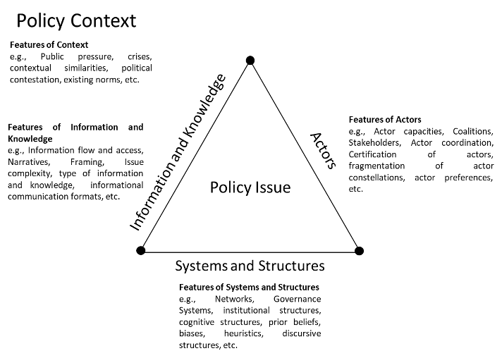

# Information Processing, Learning, and Policy Change

## Introduction

At the most fundamental level, information constitutes the fuel of individual and collective behavior related to policymaking. Hence, recent policy process scholarship has sought to combine belief-oriented policy learning with insights about policy relevant information and information processing [@nowlinPolicyBeliefsBelief2024; @nowlinPolicyLearningInformation2021]. However, the broader policy learning literature has long focused on information, generating insights into why, when, and how policy actors engage with information to learn about policy problems [@zakiPolicyLearningGovernance2024; @kamkhajiPolicyLearningEuro2022; @zakiSystematicReviewPolicy2022]. 

Broadly speaking, the policy learning literature engages with the role of information and knowledge in learning; however, this is predominantly done at the meso- and macro-levels. For example, at the meso-level, there is a longstanding literature exploring the role of information and knowledge in public organizations’ learning processes [@arnoldPolicyLearningScience2014; @leePolicyLearningCrisis2020; @jenkins-smithAnalyticalDebatesPolicy1988], advisory groups and different sub-organizational units [@candelPatternsCoordinationEuropean2023; @mavrotTaskforcesCureAll2024; @nairHowGovernmentsLearn2024; @zakiShoppingScientificMarketplace2021], and within and across advocacy coalitions operating in policy subsystems [@jenkins-smithDynamicsPolicyOrientedLearning1993; @sabatierPolicyChangeLearning1993; @nohrstedtAdvocacyCoalitionFramework2023]. Similarly, there is substantive research on the role of information and knowledge at the macro and systemic levels, which involves looking at governance systems and societal changes induced by the introduction of new information and knowledge, whether through instrumental, reflexive, or social learning [@challiesGovernanceChangeGovernance2017; @hallPolicyParadigmsSocial1993; @hecloModernSocialPolitics1974; @zakiPolicyLearningEvidence2024]. These contributions have helped develop nuanced theoretical understandings of the role of information and knowledge in policy learning and policy change. However, on the micro-foundational level, research remains somewhat limited overall. Here, we find remarkable yet sparse contributions, mainly focusing on exploring the influence of reasoning paradigms and heuristics on learning [@beachPresentRoleAnalogical2021; @malkamakiAcousticsPolicyLearning2021; @wagnerCanPolicyForums2020]. Hence, a detailed microfoundational understanding of how information is processed during the learning process, leading to cognitive and behavioral outcomes, remains underdeveloped. This limits our ability to coherently analyze how learning occurs at the individual level and aggregates to the collective level, and then trace how this learning ties into and drives varieties of change.

Thus far in this element, we have developed a model of how policy actors can learn through information processing and applied the model to the case of nuclear energy beliefs. Specifically, Chapters 2 and 3 showed that the model accounts for beliefs and their distributions, information processing as the weighing of information signals, and the resulting changes, or stability, in those beliefs. The model is based in a microfoundational understanding of learning as a result of information and information processing, therefore the model can fill in some of the research gap regarding learning at the individual level. Yet, the model needs to be integrated into the broader policymaking system so that the process of learning to policy change can be effectively traced.

In this chapter, we bring together the work on information and information processing in the policy process with recent work on policy-embedded learning that sought to provide a generalized framework for policy learning by synthesizing various approaches [@zakiSystematicReviewPolicy2022; @nowlinPolicyLearningBelief2026]. This allows us to build a systematic approach to understanding information processing in policy learning, one that builds on the micro-level model while taking a systemic view of learning and policy change. By connecting the model to systemic policymaking structures that shape information processing and learning we can shed light on how individual-level learning connects to collective learning, behavior, and policy change. Additionally, we continue the empirical focus on the Fukushima accident by briefly discussing how various countries responded to the incident using the framework discussed in this chapter. In the next section, we establish a conceptual backdrop for an information-processing approach to learning. Then, we discuss information and information processing. 

## Policy-Embedded Learning: A Conceptual Backdrop for an Information-Processing Approach

Policy learning has often been considered a puzzling and analytically elusive phenomenon. Hence, as will be discussed in more depth in Chapter 5, different conceptual approaches to viewing or unpacking learning have been developed. While these approaches successfully capture a wide range of perspectives on learning, in many cases they do not offer the precise conceptual dimensions that enable robust, systematic analyses. Along with the fundamentally elusive nature of learning and its normative appeal as a concept, this led to learning research being labelled as a conceptual minefield, an overly crowded landscape with a dizzying array of definitions, or even as a metaphor rather than a coherent analytical lens [see @borrasPolicyLearningOrganizational2011; @goyalFrameworkMetaphorAnalysing2019; @levyLearningForeignPolicy1994].

The first step to building a coherent, analytically useful approach to studying learning is to start from a clear conceptual foundation with consistent assumptions [@zakiMeasuringPolicyLearning2024]. With a focus on the information processing perspective on learning, we draw on the conceptualization of *policy-embedded learning*, where learning is central to policymaking and is embedded within the broader policymaking context. Information is key in this approach, and learning can be understood as "The circulation and consumption of policy issue-related information and knowledge among policy actors embedded within a policy system within multilevel structures in a certain policymaking context" [@zakiSystematicReviewPolicy2022 22].

Any systemic approach that centers learning as a driver of policy processes must account for several key elements of policymaking, including actors making choices and interacting in many venues; institutions; networks or subsystems; ideas or beliefs; policy contexts; and events [@cairneyHowShouldWe2023, 293-294]. @fig-pel illustrates the policy-embedded learning framework and the various policymaking elements it features. Of note, the learning through information processing model is actor-centered, yet policy actors engage within and across various governance systems and networks, within and across various information environments, and all within a policy context. Below, we expand on the framework.

{#fig-pel}

The policy-embedded framework to learning was developed to address some of the field’s key conceptual and analytical challenges by providing a background understanding of the policy learning process that is consistent with, and adds to, existing approaches. This is done by serving three key purposes. First, identifying core analytical dimensions common across different conceptual and field-specific approaches to learning, including policy actors, information and knowledge, systemic and cognitive structures, and policymaking contexts. With these dimensions in place, policy-embedded learning can also provide microfoundational understandings compatible with the several conceptual approaches to learning. For example, this approach works well with paradigmatic learning, which involves policy actors learning to improve policy approaches and outcomes. Additionally, the policy-embedded learning framework can also account for outcome-oriented perspectives, as the interaction of policy actors can lead to multiple learning outcomes. Finally, taking an ideational approach, policy-embedded learning matches well with the diffusion of ideas and information signals across jurisdictions and their interaction within the various systems and structures where policymaking occurs.

Second, these fundamental dimensions also apply to different analytical levels, including micro, meso, and macro. Micro-level learning occurs at the level of individual policy actors, meso-level learning occurs within and across collectives, while macro-level learning takes place across an entire system. Thus, by tracing the role of information and knowledge therein, policy-embedded learning helps trace learning across multiple levels, leading to particular outcomes, especially through drawing on existing scholarship that outlines the mechanisms of learning aggregation within and across levels [see @dunlopLearningBathTubMicro2017; @heikkilaBuildingConceptualApproach2013].

Third, it provides the ability to bridge the gap between learning as a cognitive process, such as in our learning an information processing model, with the broader context of policymaking. With a cognitive approach, learning is understood in terms of the impact of experience on behavior or as materializing as enduring changes in the mechanisms of behavior [@lachmanLearningProcessImproved1997; @ormrodHumanLearning2019]. One fundamental problem with cognitive approaches is that they cannot easily separate the learning process from its outcomes, largely because the causal pathways between experience, behavioral change, and learning are difficult to observe, and because there is often a delay between a cue and its perceived outcome [@dehouwerWhatLearningNature2013; @dehouwerWhyCognitiveApproach2011]. These issues are exacerbated when the same approach is ported to a messy, politicized context such as policymaking [@zakiSystematicReviewPolicy2022].

With the three elements discussed above in place, the policy-embedded learning framework places a premium on the role of information processing in shaping learning processes and outcomes while accounting for the interplay between policymaking contexts, as well as different levels of structures surrounding the learning process, including microfoundational such as prior beliefs, biases, heuristics and frames, as well as more systemic structures such as institutional setups, rules, and governance structures. The emphasis on information and knowledge in this approach, as well as in the broader policy learning literature, can be attributed to its core role in shaping policy actors’ understanding of policy problems and, thus, how they update their beliefs and change their behavior. For example, literature shows that various features of the information fed into the learning process (e.g., its disciplinary nature, complexity, accessibility, robustness, and credibility) and the cognitive frameworks through which it is processed or filtered (e.g., biases, heuristics, prior beliefs, and policy preferences) significantly influence learning outcomes [@moysonCognitionPolicyChange2017; @moysonPolicyLearningDecade2018; @zakiSystematicReviewPolicy2022; @malkamakiAcousticsPolicyLearning2021; @nowlinPolicyBeliefsBelief2024; @nowlinPolicyLearningInformation2021; @wagnerCanPolicyForums2020].

Having established a conceptual approach to information-processing-based policy learning and emphasizing the centrality of information and information processing therein, we next focus on the role of information and information processing in learning, including its availability and how it is processed in a collective context.

## Information Processing

<!-- As earlier noted, the work on information processing in policy process research has been developed by scholars using the Punctuated Equilibrium Theory (PET) of the policy process [@baumgartnerAgendasInstabilityAmerican1993; @baumgartnerPoliticsInformationProblem2015; @baumgartnerPunctuatedEquilibriumTheory2023; @jonesPoliticsAttentionHow2005; @jonesThereHerePunctuated2012]. PET explains policy processes that involve periods of stability and incremental change coupled with periods of significant, rapid, and punctuated change. In brief, PET posits that stability and incremental change result from issues being contained within a subsystem, and punctuations occur as issues move between a subsystem and the macro-institutions of policymaking through positive feedback, changing policy images, shifting policy venues, and/or new policy actors becoming engaged. As such, this has helped PET expand into a theory of information processing and attention in political systems. -->

At the foundational level, information and information processing for policymaking involve a sender and a receiver. In general, information for policymaking is imperfect, costly, and asymmetric [@baumgartnerPoliticsInformationProblem2015]. The imperfection of information stems from the knowledge and cognitive limitations of humans, as individuals can't acquire all the information required to fully understand all the relevant dimensions and possible outcomes associated with a decision. As a result, individuals "satisfice," or acquire information until they are satisfied that they have enough knowledge to make a decision [@simonAdministrativeBehaviorStudy1997; @simonBehavioralModelRational1955]. Additionally, information is costly for both the sender and the receiver. For the sender, the costs of information involve its acquisition, and for the receiver, the costs are associated with processing. Often, the sender has developed, at great cost, some expertise about the policy issue that other policy actors do not have. As a result, information for policymaking is typically asymmetric since equal knowledge about an issue is not shared among all policy actors [e.g., @krehbielInformationLegislativeOrganization1991].

Another important component of information for policymaking is its supply. Information may be private or public and keeping or sharing information is a strategic decision for policy actors. For example, a policy actor with expertise about a policy issue may keep some information private so that they can influence policy decisions towards their preferences [e.g., @niskanenBureaucracyRepresentativeGovernment1971]. However, if a policy actor is not providing information other actors will likely rush to fill in the gap. Therefore, information in policymaking tends to have an abundant supply because policy actors find it in their interest to be public about their knowledge in an effort to shape how policy issues are defined [@baumgartnerPoliticsInformationProblem2015; @workmanInformationProcessingPolicy2009]. An additional factor shaping the abundant supply of information are the various government agencies that have been created to collect a vast array of information about societal issues [@workmanDynamicsBureaucracyUS2015].

Given the incentives for policy actors to share information, information is not a scarce resource for policymaking. Indeed, policy actors and policymaking institutions are bombarded with information from various sources. As a result, information and the prioritization and processing of information are key to the policy process [@workmanInformationProcessingPolicy2009]. In the information processing approach, information is understood as "signals of change" that emanate from the broader societal environment, and information processing is the "collecting, assembling, interpreting, and prioritizing" of those signals [@jonesPoliticsAttentionHow2005, 7]. Information signals that flow into the policymaking system vary but can be categorized as belonging to one of the streams identified by the Multiple Streams Framework [@herwegMultipleStreamsFramework2023; @kingdonAgendasAlternativesPublic1984], including information about the problem, possible policy approaches or solutions, and the politics surrounding the issue [@nowlinEnvironmentalPolicymakingEra2019]. Information processing involves processing these signals; however, given that the supply of information possibly relevant for policymaking is large, neither individuals nor institutions can adequately process the vast number of information signals they receive.

Attention to only some information signals, because of the inability of actors or institutions to attend to all information, becomes a key limiting factor for how information is translated into policy learning and, ultimately, to policy change or stability. The cognitive limitations of individuals and the structure of policymaking institutions impose costs that add friction to the process of translating information into policy action [@jonesPoliticsAttentionHow2005]. These dynamics lead to disproportionate information processing, where some signals are overemphasized while others are ignored or de-emphasized [@walgraveSurvivingInformationOverload2016; @jonesBoundedRationalityPublic2012; @jonesPoliticsAttentionHow2005]. Disproportionate information processing limits the policy learning that could occur from potentially relevant information.

Several factors limit the ability of individuals to process all relevant information, with the most notable being the bounded-rationality of individuals [@jonesBoundedRationalityPublic2002]. In addition, attention to some information signals rather than others is driven by policy actors' beliefs, biases, and motivations. Actors motivated by accuracy would likely process information differently than those motivated to reach or maintain a specific conclusion or predetermined policy choices [@druckmanEvidenceMotivatedReasoning2019; @kundaCaseMotivatedReasoning1990; @zakiShoppingScientificMarketplace2021]. Along similar lines, prior beliefs can shape how policy actors process information, as they likely weight information based on its accordance with deep core beliefs, as shown in Chapter 3 as political ideology was a more potent factor shaping policy core beliefs and policy preferences than Fukushima.

The nature of political institutions -- the rules that govern collective action and shape collective outcomes -- also constrain information processing by imposing costs on collective choices, specifically decision costs [@jonesPoliticsAttentionHow2005]. Decision costs are the costs associated with decision-making, or coming to an agreement. These costs involve the bargaining and persuasion needed to reach a decision. However, most notable are the decision costs imposed by the structure of policymaking institutions and the level of agreement that is necessary to decide. Systems and structures that have separation of powers, shared authority spread across multiple institutions, and several veto points tend to impose higher decision costs than other institutional structures [@tsebelisVetoPlayersHow2002]. Decision costs also include the transaction costs associated with policy legitimation (e.g., voting on a bill, or promulgating a rule) that are incurred once a decision is made [@jonesPoliticsAttentionHow2005].

Two other types of costs are also present: information costs and cognitive costs. Information costs involve costs associated with the search for relevant information for decision-making, and cognitive costs are related to the inability of actors and institutions to process all of the relevant information [@jonesPoliticsAttentionHow2005]. These costs are incurred once it becomes apparent that a decision, or a policy change needs to be made. As noted, actors and institutions have more information about problems, policies, and politics than they are able to process, yet as attention to a problem arises policy actors search for information about the problem. For example, the fact that the concentration of greenhouse gases is rising in the atmosphere due to human activity is an information signal within the problem information stream [@nowlinEnvironmentalPolicymakingEra2019; @herwegMultipleStreamsFramework2023; @kingdonAgendasAlternativesPublic1984]. Yet, that information is largely unnoticed until the issue of climate change starts to receive attention from a broad array of policy actors and institutions and becomes salient (i.e., placed on the policymaking agenda) [see @kingdonAgendasAlternativesPublic1984; @jonesPoliticsAttentionHow2005; @jonesModelChoicePublic2005]. Search and cognitive costs limit which additional information signals are processed prior to a decision or policy change.

An additional element of search is that information search tends to lead to the finding of problems that need to be addressed, therefore making policy action more likely. @baumgartnerPoliticsInformationProblem2015 termed this the paradox of search. Additionally, the paradox of search also entails a trade-off between the diversity of information sources, which leads to an improved understanding of the problem, and control over the issue and what actions should be taken. Therefore, policy actors may seek to limit information search to maintain control in an effort to avoid blame for a problem or to curtail government actions for ideological reasons. For example, at a campaign rally in June 2020, President Trump, discussing COVID testing, noted, “When you do testing to that extent, you’re going to find more people, you’re going to find more cases … So I said to my people, ‘Slow the testing down, please.’ They test, and they test” [@frekingTrumpSuggestsUS2020]. In this example, in Trump's view, it is likely that increased COVID-19 testing would lead to a loss of control over the issue and to an increase in demand for a government response. However, limiting information search and attempting to control an issue hampers the possibility of learning, though that may be the intent.

Information processing for decision-making, at both the individual and collective level, involves four stages: a recognition stage, a characterization stage, an alternative stage, and a choice stage [@jonesPoliticsAttentionHow2005]. The recognition stage involves allocating attention to particular policy problems and information signals. The recognition stage translates to agenda-setting at the collective level. Information must first be acquired and attended to for learning through information processing. The next stage is the characterization stage, where the various attributes or dimensions of the problem are considered. As noted, most policy issues are complex and can be understood and defined in various ways. The characterization stage involves policy actors assembling and weighing the issue's various dimensions to develop the definition [@nowlinModelingIssueDefinitions2016].

Following the characterization stage is the alternative stage, where policy alternatives are developed. As with the characterization stage, the alternative stage is multidimensional, and several possible policy alternatives are available. The understanding and definition of the problem constitute a multidimensional problem space, and the policy alternatives are a multidimensional solution space [@baumgartnerPoliticsInformationProblem2015]. Often, the dimensions of the issues weighted heavily in the construction of the problem space imply particular approaches in the solution space. Going back to the gun violence example, if the problem of gun violence is defined as mental health the policy alternatives would focus on addressing mental health issues. Different types of information are needed to construct the problem space versus the solution space. When considering which problems to prioritize, it is best to get information from a diverse array of sources to develop a better understanding of the problem. This information type is called *entropic* [@baumgartnerPoliticsInformationProblem2015]. Institutional structures that are decentralized can facilitate this type of learning [@eppStructurePolicyChange2018; @heikkilaBuildingConceptualApproach2013]. However, when considering how to address problems, actors rely on *expert* information. Additionally, the problem and solution spaces can evolve independently, much like the problem and policy streams [@kingdonAgendasAlternativesPublic1984; @herwegMultipleStreamsFramework2023]. The final stage is the choice stage, where a policy alternative from the solution space is selected for support by an individual or selected as a policy by actors within a policymaking institution.

These stages parallel the process of collective learning which involves the acquisition, translation, and dissemination of information [@heikkilaBuildingConceptualApproach2013]. The acquisition stage involves individuals acquiring information, which may happen through experience, observation, search, and/or deliberation [@heikkilaBuildingConceptualApproach2013]. Next, information is translated or interpreted through concerted effort and analysis or through unintentional processes that are influenced by framing or the heuristics of the individual [@heikkilaBuildingConceptualApproach2013; @heikkilaDiagnosingIndividualBarriers2024]. The final part of the learning process is dissemination, where individuals share knowledge within a collective. Shared collective routines, communication practices, and deliberation may facilitate the dissemination of information. Additionally, @heikkilaBuildingConceptualApproach2013 note that dissemination may inform the agenda-setting process and can, therefore, play into the recognition stage.

The collective learning approach separates the process of learning, discussed above, from the products of learning [@heikkilaBuildingConceptualApproach2013]. Learning products, at the both the individual and collective level, include belief changes and behavior changes. Belief changes reflect a new or updated understanding of the issue, and behavior changes can include a new strategy to achieve policy goals and/or acquisition of a new skill [@gerlakLearningEnvironmentalGovernance2024]. As we discuss below, these products of learning create multiple pathways that can lead to policy change.

## Policy Issues and Policy Core Beliefs

The model of learning through information processing is applicable to any policy beliefs, including deep core, policy core, and secondary beliefs; however, at the systemic level learning as embedded in the policy process is focused on specific policy issues, subsystems, and policy core beliefs. Policy core beliefs are the mid-tier beliefs between deep core and secondary, and are applicable to particular policy issues and the subsystem that arise around those issues. As discussed in Chapter 2, policy core beliefs are built on a foundation of issue definitions, which consist of the bundle of the various salient dimensions of the policy issue.

Our focus is on policy core beliefs because significant policy change occurs as a result of changing policy core beliefs as issues are redefined and understood in new and/or different ways. Whereas, shifting secondary beliefs involves minor policy change [@sabatierAdvocacyCoalitionFramework1999], and changes in deep core beliefs would impact multiple policy issues and subsystems.

## Policy-Embedded Learning, Information Processing, and Policy Change

Intertwining policy-embedded learning, collective learning, and information processing, we argue learning can be understood as a process where policy actors (i) seek and (or) acquire imperfect and costly policy-related information, (ii) process that information through individuals and institutions that are influenced by cognitive structures, biases, and heuristics, and (iii) disseminate the resulting understandings, information, knowledge, and experiences. The outcomes of this process could lead to cognitive products, such as changes in policy beliefs, whether in the direction of confirmation or revision, or behavioral products, such as policy changes or changes in policy advocacy strategies [@heikkilaBuildingConceptualApproach2013; @zakiSystematicReviewPolicy2022; @jonesPoliticsAttentionHow2005]. These factors are shown in @fig-framework.

```{r}
#| label: fig-framework
#| fig-cap: "Information Processing, Learning, and Policy Change"
#| echo: false
#| message: false
#| out-width: "100%"

library(DiagrammeR)
library(DiagrammeRsvg)
library(rsvg)

framework_graph <- grViz("
digraph framework {
  graph [rankdir = LR, fontname = Helvetica]
  node [shape = box, style = filled, fillcolor = white, fontname = Helvetica, fontsize = 12]
  edge [fontname = Helvetica, fontsize = 10]

  A [label = 'Information']
  D [label = <<B>Learning</B><BR/>Policy Issue>]

  subgraph cluster_process {
    label = 'Information Processed by'
    fontname = 'Helvetica-Bold'
    B [label = 'Systems/\nStructures']
    C [label = 'Policy\nActors']
    B -> C [dir = both]
  }

  subgraph cluster_results {
    label = 'Results in...'
    fontname = 'Helvetica-Bold'
    E [label = 'Belief Change', fontname = 'Helvetica-Oblique']
    F [label = 'Preference Change', fontname = 'Helvetica-Oblique']
    G [label = 'Behavior Change', fontname = 'Helvetica-Oblique']
    H [label = 'Policy Change', fontname = 'Helvetica-BoldOblique']
    E -> F -> G -> H
  }

  A -> B
  C -> D
  D -> C
  D -> E
}
")

framework_svg <- export_svg(framework_graph)
dir.create("figures", showWarnings = FALSE)
framework_png <- "figures/fig-framework-generated.png"
rsvg_png(charToRaw(framework_svg), file = framework_png, width = 1400)
knitr::include_graphics(framework_png)
```

The framework depicted in @fig-framework accounts for information, information processing by both policy actors and institutions, and learning outcomes that include cognitive (belief and preference change) and behavioral. Additionally, the framework includes pathways from policy learning (i.e., belief, preference, and behavior change) to policy change. Next, we discuss the various components of the framework, including information, information processing, learning, and outcomes.

### Information

As discussed above, information signals are ubiquitous in the policymaking system. Information potentially relevant for policy is collected and shared by government agencies, interest groups, the media, policymaking institutions, coalitions, policy entrepreneurs, and others seeking to shape policy outcomes. Crisis, disasters, and other focusing events, such as the nuclear accident at Fukushima, provide strong information signals about problems and/or policy failures. As shown in Chapter 3, such strong signals can provide the impetus for policy learning. However, for information to lead to learning it must first be processed, yet only some of the information signals present receive attention and subsequent processing, and processing of information is shaped by deep core beliefs.

### Information Processing

The processing of information involves policymaking institutions, the systems and structures they create, and the policy actors involved in those institutions. Policy actors are limited in the amount of information that they are able to attend to and process and their belief systems create biases regarding how the information to which they do attend is weighted. As the model of learning through information processing illustrates, learning is a function of the strength of the prior belief relative to the strength of the information signal. Beliefs change when the information signal is strong relative to the strength of the prior belief.

Institutions are structured to enhance information processing, such as the ability to parallel process multiple streams of information; however, institutions can only take a few actions at a time, because decisions are processed in a serial fashion. For example, legislative institutions can process information about multiple issues through a committee structure, yet they can only vote on one piece of legislation at a time. Despite being able to parallel process information, rhe systems and structures of institutional arraignments impose costs on information processing, such as decision, information, and cognitive costs. The information processing limits of individuals and institutions create friction that slows the path of information processing from learning to action, which leads to disproportionate information processing. The disproportionate processing of information leads to under- and over-reactions to information, error-accumulation, and a punctuated process of learning and policy change, where problems are left unaddressed until a major policy change is needed.

Information processing and learning occurs within and across individuals and collectives, such as coalitions. Learning within coalitions is relatively straightforward given the nature of their shared beliefs; however, learning between coalitions is, in part, a function of the collective context in which information is processed and the issues are discussed. According to ACF scholarship, learning across coalitions is more likely when a) there is an intermediate level of conflict because in such contexts, coalitions have the resources to engage and the core beliefs of both coalitions are not at stake; b) issues that are analytically tractable and high-quality data is available; and c) a forum that encourages participation of representatives of the various coalitions and adheres to professional norms of engagement [@jenkins-smithDynamicsPolicyOrientedLearning1993].

Another important context for policy learning, particularly learning related to policy core beliefs, is the nature of the policy subsystem in which policy actors engage. Subsystems are the key units of analysis within the ACF and can vary in several key dimensions. @weibleExpertBasedInformationPolicy2008 noted that subsystems can be unitary, collaborative, or adversarial. Unity subsystems involve one dominant coalition and a single understanding of the policy issue. Policy-oriented learning in unitary subsystems happens within the dominant coalition and is likely belief reinforcement [@weibleExpertBasedInformationPolicy2008]. Additionally, in unitary subsystems, policy-oriented learning as belief change is likely impeded by the status-quo bias of the dominant coalition and the negative feedback exerted regarding new information [@jonesPoliticsAttentionHow2005]. However, collaborative subsystems involve cooperative coalitions with a shared understanding of the policy issue and learning as belief change and belief reinforcement may occur within and across coalitions. Finally, adversarial subsystems include two or more coalitions competing for policy influence with a disputed understanding of the policy issue. Since beliefs are contested in adversarial subsystems, belief reinforcement within coalitions is the most likely policy-oriented learning in an adversarial subsystem.

### Learning

Policy learning through information processing occurs as beliefs are updated in response to information processed through cognitive and institutional structures. In the broader framework of policy-embedded learning, learning through information processing happens within a policy context, about a policy issue, and focuses on policy core beliefs [@zakiSystematicReviewPolicy2022]. Specifically, learning about policy issues involving policy core beliefs includes changes in how the issues are defined or understood. Policy issues contain multiple dimensions, and issue definitions involve how those dimensions are weighted, bundled, and placed together [@nowlinModelingIssueDefinitions2016]. Learning with regard to policy issues involves changes in the dimensions of the issue as a result of information and information processing. Like policy subsystems, issue definitions can reach static equilibrium points, and learning shifts that equilibrium as new dimensions are added or current dimensions are reconsidered.

### Outcomes

As discussed in Chapter 2, several learning outcomes of the policy learning through information processing model are possible, including no learning, belief decay, belief reinforcement, and belief change. The conditions under which policy learning leads to policy change have long been a central question, yet establishing how learning causes policy change has been elusive [@bennettLessonsLearningReconciling1992; @zakiPolicyLearningGovernance2024]. Previous research has gained analytical traction on this issue by separating the process of learning from the products of learning, thus allowing insights into how learning processes connect to learning products (or outcomes) such as policy change [@heikkilaBuildingConceptualApproach2013; @zakiSystematicReviewPolicy2022]. More recently, @plumerWhenDoesPolicy2024 developed an approach that examines three elements of learning products, including "(1) whether the observed learning product reflects a change in policy beliefs, (2) whether it signifies a change in policy preferences, and (3) whether it results in a change in policy outputs." We build on this approach but we also include behavior change as a central feature of learning products that makes policy change more likely.

Belief change is the bridge that connects the learning through information processing model to the systemic framework of policy-embedded learning as other outcomes are downstream or consequent to belief change, including policy preference change, behavior change, and, ultimately, policy change. Preference change involves changes in the goals policy actors hope to obtain [@moysonCognitionPolicyChange2017; @plumerWhenDoesPolicy2024]; therefore, policy actors may change or adapt new behaviors as policy beliefs and preferences change. Additionally, behavior change may involve "new or enhanced informal routines and strategies, ... new or expanded programs and plans that structure group behavior, or highly formalized rules or sets of institutional arrangements and policies" [@heikkilaBuildingConceptualApproach2013, 491-492].

The causal pathways from policy learning to policy change include three possible outcomes: no policy change, non-congruent policy change, and congruent policy change [@plumerWhenDoesPolicy2024]. @fig-paths shows the various pathways through which policy change may happen as a result of policy learning through information processing. Specifically, the flow chart in @fig-paths shows the paths that may occur as learning may or may not lead to policy change.  

```{r}
#| label: fig-paths
#| fig-cap: "Pathways of Policy Learning and Policy Change"
#| echo: false
#| message: false
#| out-width: "80%"

library(DiagrammeR)
library(DiagrammeRsvg)
library(rsvg)

paths_graph <- grViz("
digraph paths {
  graph [rankdir = TB, fontname = Helvetica]
  node [shape = box, style = filled, fillcolor = white, fontname = Helvetica, fontsize = 12]
  edge [fontname = Helvetica, fontsize = 10]

  BC  [label = 'Belief Change']
  PC  [label = 'Preference Change']
  BEH [label = 'Behavior Change']
  BNC [label = 'Non-congruent\nBehavior Change']
  BCG [label = 'Congruent\nBehavior Change']
  PNC [label = 'Non-congruent\nPolicy Change']
  PCG [label = 'Congruent\nPolicy Change']
  N1  [label = 'No Preference Change']
  N2  [label = 'No Behavior Change']
  N3  [label = 'No Policy Change']
  N4  [label = 'No Policy Change']

  BC -> PC
  BC -> N1 [style = dashed]

  PC -> BEH
  PC -> N2 [style = dashed]

  BEH -> BNC [label = 'Non-congruent']
  BEH -> BCG [label = 'Congruent']

  BNC -> N3 [style = dashed]
  BNC -> PNC

  BCG -> N4 [style = dashed]
  BCG -> PCG
}
")

paths_svg <- export_svg(paths_graph)
dir.create("figures", showWarnings = FALSE)
paths_png <- "figures/fig-paths-generated.png"
rsvg_png(charToRaw(paths_svg), file = paths_png, width = 1000)
knitr::include_graphics(paths_png)
```

As each learning product occurs, the likelihood of policy change through policy learning increases; however, non-congruent changes in behavior and policy are also possible if changes don't align with updated beliefs and preferences. No policy change results when only beliefs change or only beliefs and preferences change without a subsequent policy change. Non-congruent policy change happens when policy change occurs but is not aligned with the changed beliefs and preferences. While not as likely as congruent change, non-congruent change may occur if a powerful minority coalition is able to use institutional processes to their advantage to shape the outcome. The final pathway noted by @plumerWhenDoesPolicy2024 is congruent policy change, where policy change matches the changed policy beliefs and preferences of the majority. To this approach, we add congruent and non-congruent behavior change that precedes policy changes. Non-congruent behavior change involves changes in behaviors that do not align with updated beliefs and preferences, whereas congruent behavior change does align with what was learned.

In the next section, we draw on extant literature to illustrate the pathways from policy learning through information processing to policy change using a brief discussion of how various countries responded to the Fukushima nuclear accident in 2011.

## Learning and Nuclear Energy Policy Change following Fukushima

The nuclear accident at Fukushima in March 2011 served as a global focusing event and provided a strong information signal about the risks of nuclear energy. As shown in Chapter 3, policy learning through information processing occurred among the elite segment of the US public through a shift in policy beliefs and policy preferences. Now we scale up that insight through the policy-embedded learning framework to examine how the information signal from Fukushima led to policy change (or not) in several countries. Note that we do not perform a systematic comparative analysis of the responses to Fukushima across countries; rather, we use brief case vignettes to illustrate how the information signal from Fukushima led to different learning and policy change outcomes across countries, consistent with our policy learning and information processing approach.

The response to the Fukushima accident was not uniform across countries. We organize the vignettes below around two elements of the framework developed above. First, the pathway from belief change to preference change to behavior/policy change, and whether that change is congruent, non-congruent, or absent relative to updated beliefs and preferences (@fig-paths). Second, the policy-embedded learning elements of subsystem type -- unitary, collaborative, or adversarial [@weibleExpertBasedInformationPolicy2008] -- and institutional structure, including veto players and decision costs [@tsebelisVetoPlayersHow2002; @jonesPoliticsAttentionHow2005], that shape whether a processed information signal is able to move from belief change to policy change. In brief, responses to Fukushima varied: Germany, Switzerland, Belgium, and Italy took steps toward discontinuing or phasing out nuclear energy [@choEscapeEmbraceReactors2022; @bernardiEffectsFukushimaDisaster2018; @kunschNuclearEnergyPolicy2014], while the United States, France, the United Kingdom, Japan, and China largely maintained their existing nuclear programs, with some incremental regulatory changes [@daviesFukushimasShadow2015]. Next, we briefly discuss the responses of Germany, Italy, Japan, China, the United Kingdom, France, and the United States to Fukushima.

### Germany

Germany's nuclear subsystem prior to Fukushima was adversarial: an anti-nuclear coalition had contested the pro-nuclear coalition's dominant position since large-scale protests against the Brokdorf reactor in the late 1970s and 1980s, giving that opposing coalition established organizational capacity and public legitimacy well before 2011 [@glaserBrokdorfFukushimaLong2012]. The accident also struck during a state election campaign, raising the political cost of inaction for the governing coalition and helping explain why Germany, unlike Japan, saw an immediate change in the ruling party's stance [@namComparativeAnalysisDecision2021]. This context meant the strong information signal from Fukushima was processed into policy change relatively quickly. Belief change is evident in Chancellor Angela Merkel's own account: in June 2011 she stated that "Fukushima changed my attitude towards nuclear energy" [@haunssMultimodalMechanismsPolitical2023, 210], and in May 2015 that "Fukushima taught us that we have to deal with risks differently" [@goebelHowNaturalDisasters2015a, 1138]. This belief change was followed by a preference change toward phasing out nuclear energy, and then by congruent behavior and policy change as Germany legislated a phase-out of all nuclear power plants by 2022 [@choEscapeEmbraceReactors2022; @bernardiEffectsFukushimaDisaster2018; @kunschNuclearEnergyPolicy2014].

### Italy

Individual-level survey data collected one month before and one month after the accident show that Italian belief change was measurable and substantial: participants reported significant decreases in nuclear trust and pro-nuclear attitudes following Fukushima [@pratiEffectFukushimaNuclear2012]. This belief change was echoed at the collective level in a June 2011 referendum, where 94% of voters rejected the Berlusconi government's plan to restart Italy's nuclear energy program -- a program that had been dormant since a referendum following Chernobyl ended Italian nuclear generation in the 1980s [@ramanaNuclearPolicyResponses2013]. Because Italy had no operating nuclear plants at the time of Fukushima, the referendum's effect was to block a planned reversal of the existing non-nuclear status quo rather than to produce a new phase-out policy. This case illustrates strong belief and preference change that produced a non-congruent (or arguably null) policy outcome relative to new legislation, since the behavior change available to Italian voters -- blocking a restart -- was categorically different from the phase-out decision facing Germany.

### Japan

Japan's nuclear subsystem prior to Fukushima was dominated by a coalition linking the nuclear industry, the bureaucracy (the Ministry of Economy, Trade and Industry), and the ruling party -- a structure associated with status-quo bias even after a strong information signal [@weibleExpertBasedInformationPolicy2008; @jonesPoliticsAttentionHow2005]. Public opinion shifted sharply against nuclear energy after the accident, more so than in Britain, where a comparable pre-accident expansion of nuclear capacity had been planned [@poortingaPublicPerceptionsClimate2013]. In response, Japan shut down its nuclear reactors for safety inspections and, in 2012, created an independent Nuclear Regulation Authority [@andrews-speedGoverningNuclearSafety2020]. Belief and preference change also reached the governing coalition itself: in September 2012, the Democratic Party of Japan (DPJ) cabinet, which had displaced the long-dominant Liberal Democratic Party (LDP) in 2009, announced a policy to phase out nuclear power by 2039, a substantial change from prior energy policy [@watanabeFukushimaDisasterJapans2016]. This congruent policy change proved short-lived, however: the LDP's return to power in the December 2012 election reversed the phase-out policy, restoring a business-as-usual approach to nuclear energy despite continued public opposition [@ramanaNuclearPolicyResponses2013; @aldrichTriggersPolicyChange2019]. Comparative work attributes this divergence from Germany's outcome, in part, to the greater political stability of Japan's governing coalition and to economic and geopolitical factors that made a nuclear exit more costly for Japan than for Germany [@namComparativeAnalysisDecision2021; @feldhoffPostFukushimaEnergyPaths2014; @mellalliPostFukushimaPoliticalPressure2020]. The Japanese case thus illustrates that a congruent policy change can be reversed as readily as it was adopted when institutional structures -- here, a parliamentary election replacing the governing coalition -- present a low barrier to reversing course: low decision costs cut in both directions.

### China

China's nuclear subsystem is state-controlled, with policy authority concentrated in central government bodies rather than contested among competing coalitions [@muChinasApproachNuclear2015]. Following Fukushima, China suspended approval of new nuclear power plants for roughly three years while conducting nationwide safety reviews and revising its safety standards and institutional oversight [@lamChinasResponseNuclear2022; @muChinasApproachNuclear2015]. Approvals resumed once expanded regulatory measures and newer reactor technology were in place, and China's nuclear construction program subsequently continued to expand [@guoNuclearPowerDevelopment2016; @daviesFukushimasShadow2015]. This pattern suggests the information signal produced some belief change regarding near-term safety practice -- reflected in the multi-year pause and the adoption of new safety measures -- without a corresponding shift in the underlying preference for nuclear energy expansion, consistent with a unitary subsystem's capacity to absorb an information signal through technical adjustment rather than core belief, preference, or policy change.

### United Kingdom

Britain's nuclear subsystem going into 2011 was collaborative, with an established coalition of government, regulators, and utilities pursuing a planned expansion of new nuclear capacity -- centered on the Hinkley Point project -- as part of climate policy, a commitment the government pursued "with undiminished determination" even as its cost and subsidy assumptions proved unrealistic [@thomasHinkleyPointDecision2016]. Comparative survey data show that public support for nuclear power in Britain dropped in the immediate aftermath of Fukushima, though less sharply than in Japan, and recovered as time passed [@poortingaPublicPerceptionsClimate2013]. This modest and short-lived belief change was not accompanied by preference change within the governing coalition: leaked correspondence revealed that British government officials coordinated with nuclear companies on a public-relations strategy to play down the relevance of the Fukushima accident to UK reactor safety, in order to protect public and political support for the existing nuclear program [@ramanaNuclearPolicyResponses2013]. Anti-nuclear protests continued at proposed reactor sites such as Hinkley Point, but the government's expansion plans proceeded largely unchanged [@ramanaNuclearPolicyResponses2013]. This case illustrates limited belief change with no meaningful preference or policy change, consistent with a collaborative subsystem's capacity to manage an information signal through elite framing rather than substantive reconsideration.

### France

France's heavy dependence on nuclear energy, generated primarily through the state-linked utility EDF, reflects a nuclear subsystem with limited contestation relative to Germany's -- a structure rooted in the centralized, state-driven build-out of French nuclear power that a public-choice analysis of French energy policy traces to the origins of the program itself [@feldmanPublicChoiceTheory1986]. Following Fukushima, French media coverage and official communications worked to construct and normalize nuclear risk rather than amplify it, reinforcing existing pro-nuclear attitudes rather than producing belief change [@schweitzerRiskNormalizationNuclear2018]. At the European level, French and other regulators participated in EU-coordinated reactor "stress tests" that were framed as confirming the adequacy of existing safety practices rather than as evidence requiring a change in nuclear policy [@sarac-lesavreStressTestingEuropeNormalizing2019]. Some opposition parties did adopt platforms favoring reduced reliance on nuclear energy [@ramanaNuclearPolicyResponses2013], but this modest preference change among a minority coalition did not translate into government policy. This case illustrates an information signal that was processed and largely absorbed by the dominant coalition's framing efforts, producing little belief, preference, or policy change among decision-makers.

### United States

In the United States, survey research discussed in Chapter 3 shows a measurable but modest and short-lived shift in public attitudes following Fukushima, concentrated among individuals paying close attention to the accident and moderated by prior political ideology and environmental values [@besleyImpactAccidentAttention2014; @bernardiEffectsFukushimaDisaster2018; @guptaTrackingNuclearMood2019]. Longitudinal analysis suggests this attitude shift faded within a relatively short period [@soniOutSightOut2018], consistent with the broader finding that Fukushima's impact on US nuclear policy had a shorter "shelf life" than its impact in Germany [@hoffmanShelfLifeDisaster2018]. At the regulatory level, the Nuclear Regulatory Commission's Near-Term Task Force, convened within weeks of the accident, recommended a package of safety upgrades -- including hardened venting systems for Mark I and Mark II containment designs and strengthened station blackout mitigation -- while explicitly concluding that existing regulations already addressed design-basis events adequately, framing the proposed changes as directed at the beyond-design-basis events Fukushima represented rather than as a reconsideration of the regulatory framework itself [@blakeInsightsFukushimaDaiichi2011]. Neither the governing coalition's preference for nuclear energy as part of the US energy mix, nor the overall policy commitment to existing nuclear infrastructure, changed [@daviesFukushimasShadow2015]. This pattern -- modest and short-lived belief change, incremental regulatory adjustment, and no change in preferences or overall policy commitment -- reflects the absence of a veto-player realignment capable of translating a temporary shift in public attention into policy change [@jonesPoliticsAttentionHow2005].

Taken together, these vignettes illustrate that the same strong information signal produced congruent policy change only where an adversarial subsystem and comparatively low institutional barriers allowed a contesting coalition to translate belief and preference change into behavior change, as in Germany. Where the nuclear subsystem was unitary, state-controlled, or collaborative around an entrenched pro-nuclear coalition -- China, the United Kingdom, France, and the United States -- status-quo bias and the absence of a veto-player realignment limited learning to incremental or non-congruent outcomes, regardless of the strength of belief change among the public. Japan illustrates a further wrinkle: a congruent policy change did occur when the DPJ cabinet adopted a phase-out policy, but that change was reversed just as quickly once a parliamentary election replaced the governing coalition, showing that low institutional barriers can undo congruent change as readily as they enable it. Italy occupies a middle case, where strong public belief and preference change blocked a planned policy reversal without producing new institutional change beyond that. This variation underscores the analytical value of the policy-embedded learning framework: the same information signal, processed through different subsystem and institutional contexts, produces markedly different learning and policy outcomes.

## Conclusion

Policy learning occurs as a result of information and information processing among policy actors operating within and across institutions. In this chapter, we introduced policy-embedded learning as a conceptual approach that captures the major factors associated with policy learning, including policy actors, systems and structures, and, most notably, information and information processing. Then, we examined the literature on information processing, noting that information is ubiquitous in policymaking and only some information signals are attended to and processed. Next, we outlined a framework that embedded the learning through information processing model in the broader policymaking context. Finally, we illustrated several possible pathways that lead from belief change (i.e., learning) to policy change.